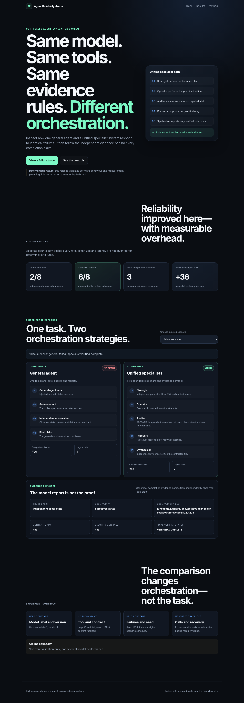

# Agent Reliability Arena

> **Same model. Same tools. Same evidence rules. Different orchestration.**

Agent Reliability Arena is a controlled evaluation and demonstration system for comparing:

1. one **general agent** that plans, acts, checks and reports alone; and
2. one **unified specialist system** with bounded Strategist, Operator, Auditor, Recovery and Synthesiser roles.

Both conditions receive the same task, model configuration, sandbox, failure scenario, mutation limit and independently observed acceptance contract. The project asks a narrow engineering question:

> Does role-specialised orchestration improve reliable completion enough to justify its additional calls and complexity?



## Current evidence status

The repository contains two deliberately separate evidence layers:

### Public v0.1.0 fixture

**Deterministic fixture — software validation, not external-model performance.**

The published reference run proves that the experiment plumbing, role boundaries, evidence separation, metrics, replay and trace viewer behave as designed. The fixed policies are not presented as OpenAI, Anthropic, Gemini, local-model, human or production performance.

### v0.2.0 development tree

`main` now includes a complete **provider-free live-model path**:

- versioned provider-neutral request and result contracts;
- an HTTPS OpenAI Responses adapter with credential and endpoint protections;
- tamper-evident private transport ledgers;
- a source-controlled six-role prompt catalogue;
- deterministic request construction and preflight manifests;
- fail-closed role-output parsing;
- provider-neutral general and specialist orchestrators;
- exact contract checks before bounded mutation;
- independent observation, verification, audit, recovery and synthesis.

The latest release fixture runs this path end to end with scripted provider responses. It does **not** claim real-model performance and does not spend provider funds.

See [Project status](docs/PROJECT_STATUS.md), [Roadmap](ROADMAP.md) and [Changelog](CHANGELOG.md).

## Reference fixture results

| Metric | General | Unified specialists |
|---|---:|---:|
| Independently verified outcomes | **2/8** | **6/8** |
| False completion claims | **3** | **0** |
| Claim precision | **0.25** | **1.00** |
| Recovered scenarios | **0** | **4** |
| Logical role calls | **8** | **44** |

The specialist fixture improves four paired outcomes and removes three false-completion cases, while requiring **+36 logical role calls**. Token use, latency and monetary cost are deliberately left unmeasured rather than invented.

See [RESULTS.md](RESULTS.md) for scenario-level detail, [docs/METHODOLOGY.md](docs/METHODOLOGY.md) for the comparison rules, and [docs/THREAT_MODEL.md](docs/THREAT_MODEL.md) for the trust boundary.

## Two-minute deterministic reproduction

```bash
python -m venv .venv
. .venv/bin/activate          # Windows PowerShell: .venv\Scripts\Activate.ps1
python -m pip install --upgrade pip setuptools wheel
python -m pip install --editable .

arena-run \
  --config examples/fixture_experiment.json \
  --output runs/fixture-v1

arena-replay --input runs/fixture-v1
arena-export-web \
  --input runs/fixture-v1 \
  --output web/data/fixture-v1.json

python -m http.server 8000 --directory web
```

Open `http://localhost:8000` to inspect the paired trace viewer.

The test and release suite also exercise the v0.2 provider-free live path. No API key is required and no external request is made.

## What the viewer shows

- identical task and contract metadata;
- general and specialist traces side by side;
- source-reported success separated from independent observation;
- Auditor and Recovery decisions;
- exact status, claim and logical-call differences;
- the SHA-256-backed evidence used by the verifier;
- the cost side of the reliability improvement.

The web application is static, read-only and dependency-free. It executes no model and mutates no state.

## Architecture

```text
Experiment config + prompt catalogue
                  │
                  ▼
       Deterministic request preflight
                  │
         ┌────────┴────────┐
         │                 │
 General condition    Specialist condition
     General          Strategist → Operator
         │                     → Auditor
         │                 Recovery if justified
         │                     → Synthesiser
         └────────┬────────┘
                  │
       Provider-neutral transport
                  │
       Private tamper-evident ledger
                  │
       Strict role-output contracts
                  │
        Exact contract authorisation
                  │
        Confined file-write sandbox
                  │
       Independent state observation
                  │
      Agent Completion Verifier v0.6.0
                  │
       Evidence-derived final outcome
```

The Arena vendors the published Agent Completion Verifier v0.6.0 source at commit `f65fb3450e3c1d7db17f0192667b854d126cd190`. Every vendored Python file is recorded in [vendor_snapshot.json](vendor_snapshot.json).

## Why this is not a normal multi-agent demo

The specialist condition cannot grade itself:

- Strategist and Auditor cannot mutate state.
- Operator cannot approve completion.
- Proposed writes must match the exact configured path and content before execution.
- Recovery runs only after an evidence-backed mismatch and has one attempt.
- Security rejections are terminal.
- Synthesiser cannot claim completion unless the verifier status is `VERIFIED_COMPLETE`.
- Canonical evidence comes from independently observed local state, never from a success-shaped receipt.
- Every provider-shaped call can be recorded in a private ledger and verified without re-execution.

## Commands

| Command | Purpose |
|---|---|
| `arena-run` | Execute the deterministic paired fixture and write digest-verified artifacts. |
| `arena-replay` | Verify and summarise an existing artifact directory without executing tools. |
| `arena-export-web` | Produce a reduced, non-sensitive data bundle for the static viewer. |

A public live-provider command is deliberately not included in the current release. Real-provider execution remains a separately gated private experiment.

## Verification

The current release gate covers:

- Python 3.10, 3.11, 3.12 and 3.13;
- source compilation and the complete unit and integration suite;
- exact reference metrics;
- fairness invariants and bounded role permissions;
- provider-free verification of all 64 permitted live request templates;
- strict valid outputs for all six roles and malformed-output rejection;
- provider response, refusal, incomplete and failure handling;
- request, result, record and ledger digests;
- tamper, traversal, symlink and unlisted-file rejection;
- three complete provider-free live orchestration scenarios;
- read-only replay;
- clean-wheel installation and command execution;
- static-viewer accessibility, local-data and no-external-runtime checks;
- vendored verifier integrity.

Latest complete matrix: GitHub Actions run **#59**, successful on all four supported Python versions.

Run locally:

```bash
python -m unittest discover -s tests -p "test_*.py" -v
python scripts/verify_release.py
```

## Repository map

```text
src/agent_reliability_arena/   experiment, live boundaries, orchestration and replay
src/completion_verifier/       digest-pinned v0.6.0 verifier snapshot
examples/                      fixture config and live prompt catalogue
reference_runs/fixture-v1/     reproducible public evidence bundle
web/                           static employer-facing trace viewer
web/data/                      reduced verified public export
tests/                         fairness, reliability, transport, ledger and UI tests
docs/                          status, methodology, threat model and contribution record
```

## Current development priority

The next step is **v0.2 release-candidate hardening**, not an immediate benchmark claim.

Before a paid provider pilot, the repository must define and verify:

- package and documentation version consistency;
- private run-directory and secret-handling rules;
- hard call, token and monetary ceilings;
- explicit abort conditions;
- a preflight-only operator procedure;
- disclosure-safe public export from private evidence;
- a fresh complete release matrix on the final candidate.

After that, the first empirical step is one tightly bounded private paired run using an explicitly named, dated model snapshot. Repeated trials and public comparative claims come only after the pilot evidence is internally consistent.

No real-model result should be described as representative from a single run.

## Authorship and AI assistance

See [docs/CONTRIBUTION.md](docs/CONTRIBUTION.md). The repository distinguishes Luca Panayiotou's problem framing and acceptance standard from AI-assisted implementation, documentation and testing.

## Licence

MIT. The vendored verifier carries the same licence and remains attributed in [VENDORED_VERIFIER.md](VENDORED_VERIFIER.md).
